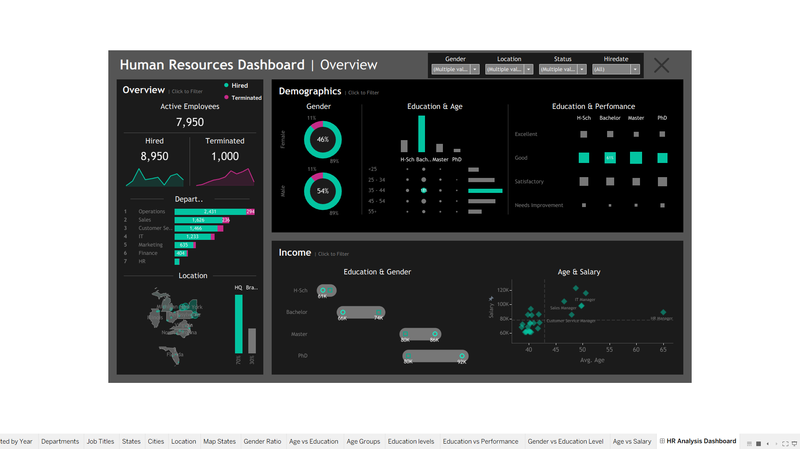

# HR Analytics Dashboard

An interactive Human Resources Analytics Dashboard developed using Tableau to analyze employee demographics, workforce trends, departmental distribution, employee status, and salary patterns.

## Live Dashboard

View the interactive dashboard on Tableau Public:

[View HR Analytics Dashboard on Tableau Public](https://public.tableau.com/app/profile/yugandhar.m2559/viz/HRAnalyticsDashboard_17848244259150/HRAnalysisDashboard)

## Dashboard Preview



## Project Overview

This project focuses on analyzing Human Resources data and presenting key workforce insights through an interactive Tableau dashboard.

The dashboard provides an overview of employee workforce metrics and allows users to explore employee characteristics and trends across different dimensions such as gender, education, age, department, location, performance, and salary.

## Key Dashboard Features

### Overview
- Active employee count
- Hired employee count
- Terminated employee count
- Department-wise employee distribution
- Employee distribution by location

### Demographics
- Gender distribution
- Education and age analysis
- Education and performance analysis

### Income Analysis
- Salary comparison by education and gender
- Average salary by age and job title
- Analysis of compensation patterns across employee groups

### Interactive Filters
The dashboard includes interactive filters for exploring the data based on:

- Gender
- Location
- Employee Status
- Hire Date

## Tools & Technologies

- Tableau
- Python
- Pandas
- Microsoft Excel / CSV

## Project Files

```text
HR Dashboard
│
├── ScreenShots
│   └── HR-Analytics-Dashboard.png
│
├── HR Analytics Dashboard.twbx
├── HumanResources.csv
├── hr_data_generator.py
└── README.md

Dataset

The project uses a structured Human Resources dataset containing employee-level information used for workforce and compensation analysis.

The dataset includes information related to:

Employee demographics
Gender
Age
Education
Department
Job Title
Location
Employee Status
Hire Date
Salary
Performance
Data Preparation

Python and Pandas were used to generate and prepare the HR dataset before importing the data into Tableau for visualization and dashboard development.

Key Insights

The dashboard enables analysis of:

Workforce size and employee status
Hiring and termination patterns
Department-wise workforce distribution
Gender and education demographics
Relationship between education and performance
Salary patterns across age groups and job titles
Workforce distribution across different locations
Purpose

The goal of this project is to demonstrate practical skills in:

Data preparation
Data visualization
Dashboard development
Exploratory data analysis
Interactive reporting
Business-oriented data storytelling
Author

Yugandhar
